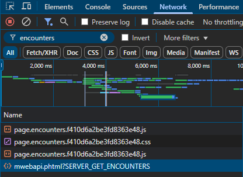

<!-- PROJECT LOGO -->
<h3 align="center">Bumble Likes Viewer</h3>

  <p align="center">
    A little python program to see, who liked you on Bumble
  </p>
</div>


<!-- TABLE OF CONTENTS -->
<details>
  <summary>Table of Contents</summary>
  <ol>
    <li>
      <a href="#about-the-project">About The Project</a>
    </li>
    <li>
      <a href="#getting-started">Getting Started</a>
    </li>
    <li>
      <a href="#usage">Usage</a>
    </li>
    <li>
      <a href="#output-files">Output files</a>
    </li>
  </ol>
</details>


<!-- ABOUT THE PROJECT -->
## About The Project

I used Bumble for a while and became curious about who liked me. I discovered Bumble Web and realized I could access the right data.<br><br>
The green dot (🟢) means, that the user liked you.<br>
The program will download the users pictures automatically.<br>
Example:
<table border-collapse: collapse>
  <tbody>
  <tr>
    <td>
      <pre>
<code>🟢 Laura, 22
    Occupation: Studentin at TU Wien
    Location: Vienna ~5 km away
    About me: I love programming
    Height: 170 cm
    Exercise: Sometimes
    Education level: Studying my undergrad
    Drinking: Socially
    Smoking: Never
    Gender: Woman
    Looking for: Relationship
    Kids: Want someday
    Star sign: Scorpio
    Politics: Middle</code></pre>
  </td>
    <td>
<pre>
<code>🔴 Klara, 25
    Occupation: Studentin at Uni Wien
    Location: Vienna ~10 km away
    About me: I love running
    Height: 175 cm
    Exercise: Active
    Education level: Studying my undergrad
    Drinking: Never
    Smoking: Never
    Gender: Woman
    Looking for: Relationship
    Kids: Want someday
    Star sign: Taurus
    Religion: Christian</code></pre>
    </td>
  </tr>
  </tbody>
</table>


<!-- GETTING STARTED -->
## Getting Started

You need Python 3 and Requests to use this project<br>
And a Bumble account :)

## Installation 
1. Download the source code
```sh
git clone https://github.com/Kempeter/bumble-likes.git
```
2. Install the required libraries
```sh
pip install -r requirements.txt
```


<!-- USAGE EXAMPLES -->
## Usage
1.  Create a Bumble account.
2.  Log in using a web browser such as Chrome, Firefox, or Opera.
3.  Open Developer Tools:
  * Chrome ```Ctrl + Shift + C```
  * Firefox ```Ctrl + Shift + I```
  * Opera ```Ctrl + Shift + H```
4. Navigate to the Network tab.
5. In the filter/search bar, enter ```encounters```.<br>
Look for a request named:
```mwebapi.phtml?SERVER_GET_ENCOUNTERS``` <br><br> 
6. Copy the response body and paste it into a file named ```encounters.json```
7. Open ```config.json``` and set your ```User-Agent``` string accordingly.
8. You can set the ```download``` variable to ```true``` or ```false```:<br>
* If ```true```, the program will download pictures from the selected profiles.
9. Run the script by typing:
```sh
py main.py
```
10. Enjoy!

## Output Files:
```profiles.txt``` — Contains saved user profile information.<br>

```saved_profiles.txt``` — Stores the IDs of profiles whose information was saved.<br>

```saved.txt``` — Stores the IDs of profiles whose pictures were downloaded.

